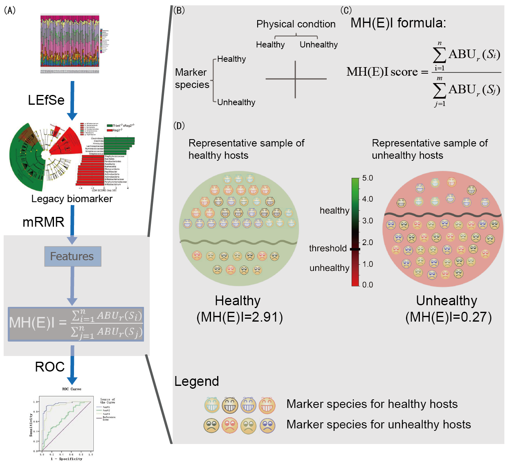

# MH(E)I
Scripts for MH(E)I (Microbial-based Human / Environment Index) classifer.  

 
Workflow and principle of MH(E)I classifier. (A) Overview of MH(E)I classifier pipeline. Two groups of selected biomarkers (5 per group as default), which  were generated by LEfSe and mRMR, were served as the features for the input of MH(E)I formula to compute index scores. (B) Table of biomarkers and group information for MH(E)I. (C) MH(E)I classifier formula. (D) Schematic diagraph of MH(E)I application for samples representing two groups. 

## Requirements
* Python
* Python libraries: pandas, matplotlib, sklearn, scipy, argparse, random, time, re
* R
* R libraries: argparse, pROC
* [LEfSe](http://huttenhower.sph.harvard.edu/lefse/)
* [mRMR](http://home.penglab.com/proj/mRMR/)

## Console command line:

### Feature Selection
1. Run LEfSe scripts to select legacy biomarkers. Input is the same as LEfSe. For example, Class informantion (A and B) is in the second row.
> format_input.py input_abundance_file lefse.formatted.in -c 1 -s -1 -u 2 -o 1000000  
> Run_lefse.py lefse.formatted.in lefse.lda.res -y 1

2. Run this script to extract and accumulate the abundance of legacy biomarkers selected by Lefse.
> python extract_biomarkers_from_lefse.py -i lefse.lda.res -f input_abundance_file

3. Run mRMR to select reprentative biomarkers from legacy biomarkers.
> mrmr -i A_biomarker.csv -m MID -n 5 -t 1 | tee A_biomarker_mrmr.txt  
> mrmr -i B_biomarker.csv -m MID -n 5 -t 1 | tee B_biomarker_mrmr.txt

4. Run this script to extract the abundance of legacy biomarkers selected by mRMR.
> python extract_features_from_mrmr.py -i A_biomarker_mrmr.txt B_biomarker_mrmr.txt -t A_biomarker.csv B_biomarker.csv 

### Classification analysis
5. Run this command to remove txts if they exist.
> rm test.txt train.txt

6. Run this script to divide samples to train(80%) and test(20%) datasets.
    If the total abundance of biomarkers for A class is bigger than B's, the result would be better.
>python divide28.py -f mrmr_features_abd.txt -g A -a B

7. This script is used for train and test mei model.
    MH(E)I model:   

      
 
> python me_h_i_model.py -f train.txt -t test.txt -g A

8. Run this this script to plot ROC curve for MH(E)I
>Rscript plot_roc.R -m test_mei_list_for_roc_r.txt -f mrmr_features_abd.txt -n human/environment

### Auto-run script
- If you don't want to run scripts step by step, you can use this CCL:
> sh run.sh input_abundance_file A B A B niche(human/environment) path_of_scripts
